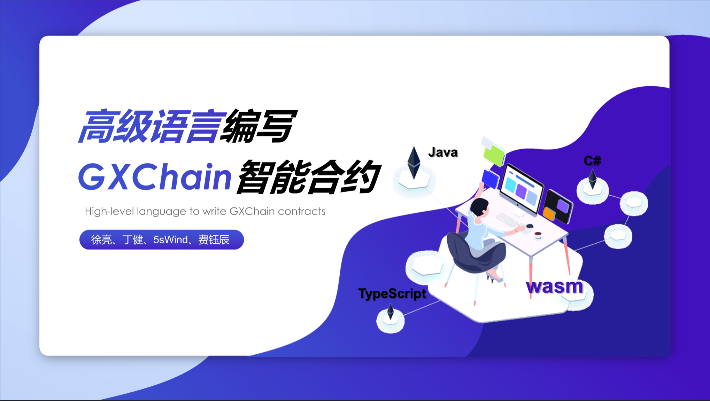

# Blank Team

Modify smart contract ide for WebAssembly compatibility, and generate abi file from Typescript to GXChain ABI automatically.

## ABIgen

Covert languages to GXChain ABI. ABI generation for GXChain using regex.

## Compiler

A WebAssembly compiler to compile languages to wasm binary files.

## Examples

We made a example including typescript, C, and Rust languages to cast them to wasm binaries and upload to GXChain. See [examples](https://github.com/COAOX/BlankT/tree/master/examples).

## IDE

[Webassembly Studio](https://webassembly.studio/)

[GXChain smart contract ide](https://github.com/gxchain/gxc-smart-contract-ide)

## Language

- Typescript
- Java
- C#
